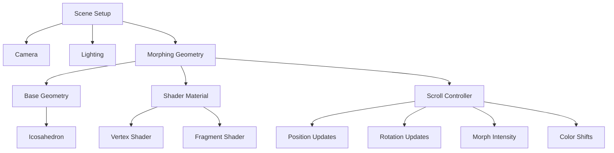

# Animation Specifications & Three.js Architecture

Detailed technical specifications for all animations, scroll interactions, and the Three.js morphing shape system.

---

## Table of Contents

1. [Three.js Morphing Shape System](#threejs-morphing-shape-system)
2. [Scroll-Driven Animation Timeline](#scroll-driven-animation-timeline)
3. [Section-Specific Animations](#section-specific-animations)
4. [Micro-Interactions](#micro-interactions)
5. [Performance Optimization](#performance-optimization)
6. [Mobile Adaptations](#mobile-adaptations)

---

## Three.js Morphing Shape System

### Scene Architecture



### Scene Configuration

```javascript
// Scene Setup Parameters
const sceneConfig = {
  scene: {
    background: 0x000000,
    fog: null,
  },
  
  camera: {
    fov: 45,
    near: 0.1,
    far: 1000,
    position: { x: 0, y: 0, z: 5 },
  },
  
  renderer: {
    antialias: true,
    alpha: true,
    powerPreference: 'high-performance',
    pixelRatio: Math.min(window.devicePixelRatio, 2),
  },
};
```

### Morphing Geometry Specifications

#### Base Geometry
```javascript
const geometryConfig = {
  type: 'IcosahedronGeometry',
  radius: 1.5,
  detail: 4, // Subdivision level (desktop)
  
  // Mobile optimization
  detailMobile: 2, // Reduced for mobile
  
  // Vertex count
  vertexCount: {
    desktop: 2562, // detail: 4
    mobile: 162,   // detail: 2
  },
};
```

#### Material Properties
```javascript
const materialConfig = {
  // Base properties
  color: 0xffffff,
  metalness: 0.9,
  roughness: 0.1,
  
  // Glass/transmission properties
  transmission: 0.9,
  thickness: 0.5,
  ior: 1.5, // Index of refraction
  
  // Reflections
  envMapIntensity: 1.5,
  clearcoat: 1.0,
  clearcoatRoughness: 0.1,
  
  // Rendering
  side: THREE.DoubleSide,
  transparent: true,
  opacity: 1.0,
};
```

### Lighting Setup

```javascript
const lightingConfig = {
  ambient: {
    color: 0xffffff,
    intensity: 0.4,
  },
  
  directional: {
    color: 0xffffff,
    intensity: 0.8,
    position: { x: 5, y: 5, z: 5 },
    castShadow: false,
  },
  
  pointLights: [
    {
      color: 0x4444ff,
      intensity: 0.5,
      position: { x: -3, y: 2, z: 3 },
      distance: 10,
    },
    {
      color: 0xff4444,
      intensity: 0.3,
      position: { x: 3, y: -2, z: 3 },
      distance: 10,
    },
  ],
};
```

### Shader System

#### Vertex Shader (vertex.glsl)

```glsl
// Uniforms
uniform float uTime;
uniform float uScrollProgress;
uniform float uMorphIntensity;
uniform vec2 uResolution;

// Varyings
varying vec3 vNormal;
varying vec3 vPosition;
varying vec2 vUv;

// Noise function (Simplex/Perlin)
vec3 mod289(vec3 x) { return x - floor(x * (1.0 / 289.0)) * 289.0; }
vec4 mod289(vec4 x) { return x - floor(x * (1.0 / 289.0)) * 289.0; }
vec4 permute(vec4 x) { return mod289(((x*34.0)+1.0)*x); }
vec4 taylorInvSqrt(vec4 r) { return 1.79284291400159 - 0.85373472095314 * r; }

float snoise(vec3 v) {
  // Simplex noise implementation
  // ... (standard simplex noise code)
}

void main() {
  vNormal = normal;
  vUv = uv;
  
  // Base position
  vec3 pos = position;
  
  // Noise-based displacement
  float noiseFreq = 1.5;
  float noiseAmp = 0.3;
  vec3 noisePos = pos * noiseFreq + vec3(uTime * 0.1);
  
  float noise = snoise(noisePos) * noiseAmp;
  
  // Apply displacement along normal
  pos += normal * noise * uMorphIntensity;
  
  // Scroll-based deformation
  float scrollDeform = sin(pos.y * 2.0 + uScrollProgress * 3.14159) * 0.1;
  pos += normal * scrollDeform * uScrollProgress;
  
  vPosition = pos;
  
  // Final position
  gl_Position = projectionMatrix * modelViewMatrix * vec4(pos, 1.0);
}
```

#### Fragment Shader (fragment.glsl)

```glsl
// Uniforms
uniform float uTime;
uniform float uScrollProgress;
uniform vec3 uColor;
uniform float uOpacity;
uniform samplerCube uEnvMap;

// Varyings
varying vec3 vNormal;
varying vec3 vPosition;
varying vec2 vUv;

void main() {
  // Fresnel effect
  vec3 viewDirection = normalize(cameraPosition - vPosition);
  float fresnel = pow(1.0 - dot(viewDirection, vNormal), 3.0);
  
  // Base color with scroll-based shift
  vec3 baseColor = uColor;
  vec3 accentColor = vec3(0.3, 0.5, 1.0); // Blue accent
  vec3 finalColor = mix(baseColor, accentColor, uScrollProgress * 0.5);
  
  // Apply fresnel
  finalColor = mix(finalColor, vec3(1.0), fresnel * 0.5);
  
  // Opacity based on scroll and fresnel
  float opacity = uOpacity * (0.7 + fresnel * 0.3);
  opacity *= (1.0 - uScrollProgress * 0.5);
  
  gl_FragColor = vec4(finalColor, opacity);
}
```

### Scroll Integration

#### Scroll Progress Calculation

```javascript
class ScrollController {
  constructor(mesh, camera) {
    this.mesh = mesh;
    this.camera = camera;
    this.scrollProgress = 0;
    this.heroHeight = window.innerHeight;
  }
  
  update(scrollY) {
    // Calculate progress through hero section (0 to 1)
    this.scrollProgress = Math.min(scrollY / this.heroHeight, 1);
    
    // Update mesh transformations
    this.updatePosition();
    this.updateRotation();
    this.updateScale();
    this.updateMorph();
    this.updateOpacity();
  }
  
  updatePosition() {
    // Move shape backwards and down as user scrolls
    const targetZ = -5 - (this.scrollProgress * 10);
    const targetY = -this.scrollProgress * 2;
    
    this.mesh.position.z = THREE.MathUtils.lerp(
      this.mesh.position.z,
      targetZ,
      0.1
    );
    
    this.mesh.position.y = THREE.MathUtils.lerp(
      this.mesh.position.y,
      targetY,
      0.1
    );
  }
  
  updateRotation() {
    // Continuous rotation + scroll-based speed
    const baseSpeed = 0.001;
    const scrollSpeed = this.scrollProgress * 0.002;
    
    this.mesh.rotation.y += baseSpeed + scrollSpeed;
    this.mesh.rotation.x += (baseSpeed + scrollSpeed) * 0.5;
  }
  
  updateScale() {
    // Scale up slightly, then down on exit
    let scale;
    if (this.scrollProgress < 0.5) {
      scale = 1 + (this.scrollProgress * 0.4); // 1.0 to 1.2
    } else {
      scale = 1.2 - ((this.scrollProgress - 0.5) * 0.8); // 1.2 to 0.8
    }
    
    this.mesh.scale.setScalar(scale);
  }
  
  updateMorph() {
    // Update shader uniform for morph intensity
    this.mesh.material.uniforms.uMorphIntensity.value = 
      0.5 + (Math.sin(this.scrollProgress * Math.PI) * 0.5);
  }
  
  updateOpacity() {
    // Fade out in final 30% of scroll
    let opacity = 1.0;
    if (this.scrollProgress > 0.7) {
      opacity = 1.0 - ((this.scrollProgress - 0.7) / 0.3);
    }
    
    this.mesh.material.uniforms.uOpacity.value = opacity;
  }
}
```

---

## Scroll-Driven Animation Timeline

### Global Scroll Phases

```javascript
const scrollPhases = {
  // Phase 1: Hero Section (0% - 100vh)
  hero: {
    start: 0,
    end: '100vh',
    animations: [
      'hero-3d-morph',
      'hero-title-parallax',
      'hero-fade-out',
    ],
  },
  
  // Phase 2: Projects Intro (100vh - 150vh)
  projectsIntro: {
    start: '100vh',
    end: '150vh',
    animations: [
      'projects-title-reveal',
      'first-project-fade-in',
    ],
  },
  
  // Phase 3: Projects Showcase (150vh - 450vh)
  projects: {
    start: '150vh',
    end: '450vh',
    animations: [
      'project-parallax',
      'project-reveals',
      'project-image-scale',
    ],
  },
  
  // Phase 4: Experience (450vh - 550vh)
  experience: {
    start: '450vh',
    end: '550vh',
    animations: [
      'timeline-draw',
      'skill-bars',
      'text-reveals',
    ],
  },
  
  // Phase 5: Awards (550vh - 600vh)
  awards: {
    start: '550vh',
    end: '600vh',
    animations: [
      'grid-stagger-in',
      'award-card-hover',
    ],
  },
  
  // Phase 6: Contact (600vh - end)
  contact: {
    start: '600vh',
    end: 'end',
    animations: [
      'form-fade-in',
      'social-links-stagger',
    ],
  },
};
```

### GSAP ScrollTrigger Configuration

```javascript
// Hero 3D Morph Timeline
gsap.timeline({
  scrollTrigger: {
    trigger: '#hero',
    start: 'top top',
    end: 'bottom top',
    scrub: 1,
    onUpdate: (self) => {
      scrollController.update(self.progress);
    },
  },
});

// Hero Text Parallax
gsap.to('#hero-title', {
  scrollTrigger: {
    trigger: '#hero',
    start: 'top top',
    end: 'bottom top',
    scrub: 1,
  },
  y: -100,
  opacity: 0,
  ease: 'power2.inOut',
});

// Project Reveals
gsap.utils.toArray('.project-card').forEach((card, index) => {
  gsap.from(card, {
    scrollTrigger: {
      trigger: card,
      start: 'top 80%',
      end: 'top 50%',
      scrub: 1,
      toggleActions: 'play none none reverse',
    },
    y: 100,
    opacity: 0,
    scale: 0.95,
    duration: 1,
    ease: 'power2.out',
  });
});
```

---

## Section-Specific Animations

### Hero Section

#### Tagline Animation
```javascript
const taglineAnimation = {
  type: 'fade-in-up',
  delay: 0.3,
  duration: 1.2,
  ease: 'power3.out',
  
  from: {
    opacity: 0,
    y: 30,
  },
  to: {
    opacity: 1,
    y: 0,
  },
};
```

#### Main Title Animation
```javascript
const titleAnimation = {
  type: 'split-text-reveal',
  delay: 0.6,
  duration: 1.5,
  ease: 'power3.out',
  stagger: 0.05,
  
  splitBy: 'chars',
  from: {
    opacity: 0,
    y: 50,
    rotationX: -90,
  },
  to: {
    opacity: 1,
    y: 0,
    rotationX: 0,
  },
};
```

#### Scroll Indicator
```javascript
const scrollIndicatorAnimation = {
  type: 'bounce-loop',
  delay: 2,
  duration: 1.5,
  repeat: -1,
  ease: 'power2.inOut',
  yoyo: true,
  
  to: {
    y: 10,
  },
};
```

### Projects Section

#### Project Card Reveal
```javascript
const projectCardAnimation = {
  type: 'fade-in-up-scale',
  trigger: 'on-enter',
  threshold: 0.2,
  
  from: {
    opacity: 0,
    y: 100,
    scale: 0.95,
  },
  to: {
    opacity: 1,
    y: 0,
    scale: 1,
    duration: 1,
    ease: 'power2.out',
  },
};
```

#### Project Image Parallax
```javascript
const imageParallax = {
  type: 'scroll-parallax',
  speed: 0.5, // 50% of scroll speed
  
  scrollTrigger: {
    trigger: '.project-image',
    start: 'top bottom',
    end: 'bottom top',
    scrub: 1,
  },
  
  to: {
    y: '-20%',
  },
};
```

#### Project Image Hover
```javascript
const imageHoverAnimation = {
  type: 'scale-overlay',
  duration: 0.6,
  ease: 'power2.out',
  
  image: {
    scale: 1.1,
  },
  overlay: {
    opacity: 0.7,
  },
};
```

### Experience Section

#### Timeline Draw Animation
```javascript
const timelineAnimation = {
  type: 'line-draw',
  trigger: 'on-enter',
  threshold: 0.3,
  
  from: {
    strokeDashoffset: 1000,
  },
  to: {
    strokeDashoffset: 0,
    duration: 2,
    ease: 'power2.inOut',
  },
};
```

#### Skill Bar Animation
```javascript
const skillBarAnimation = {
  type: 'width-grow',
  trigger: 'on-enter',
  stagger: 0.1,
  
  from: {
    width: 0,
    opacity: 0,
  },
  to: {
    width: 'var(--skill-level)', // CSS variable
    opacity: 1,
    duration: 1.2,
    ease: 'power3.out',
  },
};
```

### Awards Section

#### Grid Stagger Animation
```javascript
const awardGridAnimation = {
  type: 'stagger-fade-in',
  trigger: 'on-enter',
  
  items: '.award-card',
  stagger: 0.08,
  
  from: {
    opacity: 0,
    y: 50,
    scale: 0.9,
  },
  to: {
    opacity: 1,
    y: 0,
    scale: 1,
    duration: 0.8,
    ease: 'back.out(1.5)',
  },
};
```

### Contact Section

#### Form Field Animation
```javascript
const formAnimation = {
  type: 'sequential-fade-in',
  trigger: 'on-enter',
  
  fields: ['.form-field'],
  stagger: 0.15,
  
  from: {
    opacity: 0,
    x: -30,
  },
  to: {
    opacity: 1,
    x: 0,
    duration: 0.8,
    ease: 'power2.out',
  },
};
```

---

## Micro-Interactions

### Magnetic Hover Effect

```javascript
class MagneticHover {
  constructor(element, strength = 0.5) {
    this.element = element;
    this.strength = strength;
    this.rect = element.getBoundingClientRect();
    
    this.init();
  }
  
  init() {
    this.element.addEventListener('mousemove', (e) => {
      const x = e.clientX - this.rect.left - this.rect.width / 2;
      const y = e.clientY - this.rect.top - this.rect.height / 2;
      
      const moveX = x * this.strength;
      const moveY = y * this.strength;
      
      gsap.to(this.element, {
        x: moveX,
        y: moveY,
        duration: 0.3,
        ease: 'power2.out',
      });
    });
    
    this.element.addEventListener('mouseleave', () => {
      gsap.to(this.element, {
        x: 0,
        y: 0,
        duration: 0.5,
        ease: 'elastic.out(1, 0.5)',
      });
    });
  }
}
```

### Button Hover Animation

```javascript
const buttonHoverConfig = {
  duration: 0.3,
  ease: 'power2.out',
  
  onEnter: {
    scale: 1.05,
    boxShadow: '0 10px 30px rgba(255,255,255,0.2)',
  },
  
  onLeave: {
    scale: 1,
    boxShadow: '0 5px 15px rgba(255,255,255,0.1)',
  },
};
```

### Link Underline Animation

```css
.link {
  position: relative;
  overflow: hidden;
}

.link::after {
  content: '';
  position: absolute;
  bottom: 0;
  left: 0;
  width: 100%;
  height: 2px;
  background: white;
  transform: translateX(-100%);
  transition: transform 0.4s cubic-bezier(0.645, 0.045, 0.355, 1);
}

.link:hover::after {
  transform: translateX(0);
}
```

### Card Lift Effect

```javascript
const cardLiftConfig = {
  duration: 0.4,
  ease: 'power2.out',
  
  onEnter: {
    y: -10,
    scale: 1.02,
    boxShadow: '0 20px 60px rgba(255,255,255,0.15)',
  },
  
  onLeave: {
    y: 0,
    scale: 1,
    boxShadow: '0 10px 30px rgba(255,255,255,0.05)',
  },
};
```

---

## Performance Optimization

### Frame Rate Management

```javascript
class PerformanceManager {
  constructor() {
    this.fps = 60;
    this.frameInterval = 1000 / this.fps;
    this.lastFrameTime = 0;
    this.isLowPerformance = false;
  }
  
  shouldRender(currentTime) {
    const elapsed = currentTime - this.lastFrameTime;
    
    if (elapsed > this.frameInterval) {
      this.lastFrameTime = currentTime;
      return true;
    }
    
    return false;
  }
  
  detectPerformance() {
    // Check device capabilities
    const isMobile = /iPhone|iPad|iPod|Android/i.test(navigator.userAgent);
    const hasLowRAM = navigator.deviceMemory && navigator.deviceMemory < 4;
    const hasSlowCPU = navigator.hardwareConcurrency && navigator.hardwareConcurrency < 4;
    
    this.isLowPerformance = isMobile || hasLowRAM || hasSlowCPU;
    
    if (this.isLowPerformance) {
      this.fps = 30;
      this.frameInterval = 1000 / this.fps;
    }
  }
}
```

### LOD (Level of Detail) System

```javascript
const lodConfig = {
  high: {
    geometryDetail: 4,
    particleCount: 1000,
    shadowQuality: 'high',
    antialiasing: true,
  },
  
  medium: {
    geometryDetail: 3,
    particleCount: 500,
    shadowQuality: 'medium',
    antialiasing: true,
  },
  
  low: {
    geometryDetail: 2,
    particleCount: 100,
    shadowQuality: 'low',
    antialiasing: false,
  },
};
```

### Render Optimization

```javascript
function optimizeRender(renderer, camera, scene) {
  // Frustum culling
  camera.updateMatrixWorld();
  const frustum = new THREE.Frustum();
  const projScreenMatrix = new THREE.Matrix4();
  projScreenMatrix.multiplyMatrices(
    camera.projectionMatrix,
    camera.matrixWorldInverse
  );
  frustum.setFromProjectionMatrix(projScreenMatrix);
  
  // Only render visible objects
  scene.traverse((object) => {
    if (object.isMesh) {
      object.visible = frustum.intersectsObject(object);
    }
  });
}
```

---

## Mobile Adaptations

### Reduced Animation Complexity

```javascript
const mobileAnimationConfig = {
  // Disable complex animations on mobile
  disableParallax: true,
  reducedMotion: window.matchMedia('(prefers-reduced-motion: reduce)').matches,
  
  // Simplified 3D
  use3D: window.innerWidth > 768,
  use2DFallback: window.innerWidth <= 768,
  
  // Touch-optimized
  hoverEffects: 'none', // Use tap/touch instead
  magneticRange: 20, // Increased for touch targets
};
```

### 2D Fallback for Mobile

```javascript
class ShapeFallback {
  constructor(container) {
    this.container = container;
    this.createGradientShape();
  }
  
  createGradientShape() {
    // Create CSS-based animated gradient
    const shape = document.createElement('div');
    shape.className = 'gradient-shape-fallback';
    shape.style.cssText = `
      width: 300px;
      height: 300px;
      border-radius: 40% 60% 70% 30% / 40% 50% 60% 50%;
      background: linear-gradient(45deg, #fff 0%, #666 100%);
      animation: morphShape 8s ease-in-out infinite;
      opacity: 0.3;
    `;
    
    this.container.appendChild(shape);
  }
}
```

### Touch Gestures

```javascript
class TouchGestures {
  constructor() {
    this.startY = 0;
    this.currentY = 0;
  }
  
  init() {
    document.addEventListener('touchstart', (e) => {
      this.startY = e.touches[0].clientY;
    });
    
    document.addEventListener('touchmove', (e) => {
      this.currentY = e.touches[0].clientY;
      const delta = this.startY - this.currentY;
      
      // Smooth scroll on mobile
      window.scrollBy({
        top: delta * 0.5,
        behavior: 'smooth',
      });
    });
  }
}
```

---

## Animation Performance Metrics

### Target Metrics

```javascript
const performanceTargets = {
  desktop: {
    fps: 60,
    renderTime: '<16ms',
    interactionDelay: '<100ms',
    scrollSmooth: '60fps',
  },
  
  mobile: {
    fps: 30,
    renderTime: '<33ms',
    interactionDelay: '<200ms',
    scrollSmooth: '30fps',
  },
  
  // Memory usage
  memory: {
    textureMemory: '<100MB',
    geometryMemory: '<50MB',
    totalJS: '<20MB',
  },
};
```

### Performance Monitoring

```javascript
class PerformanceMonitor {
  constructor() {
    this.fps = 0;
    this.frameCount = 0;
    this.lastTime = performance.now();
  }
  
  update() {
    this.frameCount++;
    const currentTime = performance.now();
    const elapsed = currentTime - this.lastTime;
    
    if (elapsed >= 1000) {
      this.fps = Math.round((this.frameCount * 1000) / elapsed);
      this.frameCount = 0;
      this.lastTime = currentTime;
      
      // Log or display FPS
      console.log(`FPS: ${this.fps}`);
      
      // Adjust quality if needed
      if (this.fps < 30) {
        this.reducesQuality();
      }
    }
  }
  
  reduceQuality() {
    // Implement quality reduction strategies
    console.warn('Performance below threshold, reducing quality');
  }
}
```

---

**Document Version:** 1.0  
**Last Updated:** October 2025  
**Related:** [`ARCHITECTURE.md`](ARCHITECTURE.md), [`FILE_STRUCTURE.md`](FILE_STRUCTURE.md)