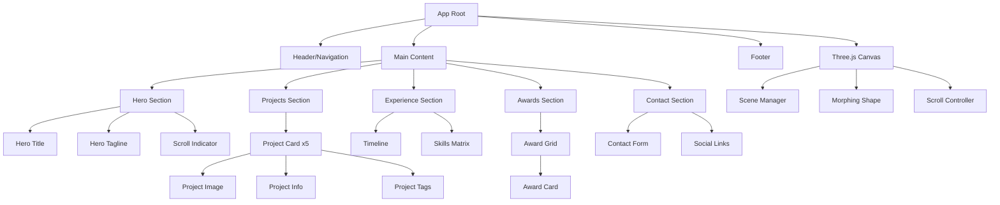

# Component Architecture & Modular Structure

Detailed breakdown of all components, their responsibilities, props, and interactions.

---

## Table of Contents

1. [Component Hierarchy](#component-hierarchy)
2. [Core Components](#core-components)
3. [Layout Components](#layout-components)
4. [Section Components](#section-components)
5. [UI Components](#ui-components)
6. [Component Communication](#component-communication)

---

## Component Hierarchy



---

## Core Components

### App Initializer

**File:** `src/js/main.js`

**Responsibilities:**
- Initialize all systems on load
- Coordinate component lifecycle
- Handle global events
- Manage performance monitoring

**Structure:**
```javascript
class App {
  constructor() {
    this.smoothScroll = null;
    this.threeScene = null;
    this.components = new Map();
    this.isInitialized = false;
  }
  
  async init() {
    // 1. Initialize smooth scroll
    await this.initSmoothScroll();
    
    // 2. Initialize Three.js scene
    await this.initThreeScene();
    
    // 3. Initialize components
    await this.initComponents();
    
    // 4. Setup scroll triggers
    this.setupScrollTriggers();
    
    // 5. Handle page load animations
    this.pageLoadAnimation();
    
    this.isInitialized = true;
  }
  
  initSmoothScroll() {
    this.smoothScroll = new Lenis({
      duration: 1.2,
      easing: (t) => Math.min(1, 1.001 - Math.pow(2, -10 * t)),
      smooth: true,
    });
    
    // Lenis animation frame
    const raf = (time) => {
      this.smoothScroll.raf(time);
      requestAnimationFrame(raf);
    };
    
    requestAnimationFrame(raf);
  }
  
  async initThreeScene() {
    const canvas = document.getElementById('three-canvas');
    this.threeScene = new ThreeScene(canvas);
    await this.threeScene.init();
  }
  
  async initComponents() {
    // Header
    this.components.set('header', new Header());
    
    // Hero
    this.components.set('hero', new Hero());
    
    // Projects
    this.components.set('projects', new Projects());
    
    // Experience
    this.components.set('experience', new Experience());
    
    // Awards
    this.components.set('awards', new Awards());
    
    // Contact
    this.components.set('contact', new Contact());
    
    // Initialize all
    for (const [name, component] of this.components) {
      await component.init();
    }
  }
  
  setupScrollTriggers() {
    // GSAP ScrollTrigger integration with Lenis
    this.smoothScroll.on('scroll', ScrollTrigger.update);
    
    gsap.ticker.add((time) => {
      this.smoothScroll.raf(time * 1000);
    });
    
    gsap.ticker.lagSmoothing(0);
  }
  
  pageLoadAnimation() {
    const tl = gsap.timeline();
    
    tl.to('.loader', {
      opacity: 0,
      duration: 0.5,
      onComplete: () => {
        document.querySelector('.loader')?.remove();
      },
    })
    .from('#hero-tagline', {
      opacity: 0,
      y: 30,
      duration: 1,
      ease: 'power3.out',
    }, '-=0.2')
    .from('#hero-title', {
      opacity: 0,
      y: 50,
      duration: 1.2,
      ease: 'power3.out',
    }, '-=0.8');
  }
}

// Initialize app
const app = new App();
app.init();
```

---

## Layout Components

### Header/Navigation

**File:** `src/js/components/Header.js`

**Purpose:** Main navigation and site header

**Features:**
- Sticky navigation with scroll behavior
- Mobile hamburger menu
- Active section highlighting
- Smooth scroll to sections

**Structure:**
```javascript
class Header {
  constructor() {
    this.element = document.getElementById('header');
    this.nav = this.element.querySelector('nav');
    this.menuToggle = this.element.querySelector('.menu-toggle');
    this.navLinks = this.element.querySelectorAll('.nav-link');
    this.isMenuOpen = false;
    this.lastScrollY = 0;
  }
  
  init() {
    this.setupEventListeners();
    this.setupScrollBehavior();
    this.setupActiveSection();
  }
  
  setupEventListeners() {
    // Mobile menu toggle
    this.menuToggle?.addEventListener('click', () => {
      this.toggleMenu();
    });
    
    // Smooth scroll on nav click
    this.navLinks.forEach(link => {
      link.addEventListener('click', (e) => {
        e.preventDefault();
        const target = link.getAttribute('href');
        this.scrollToSection(target);
        if (this.isMenuOpen) this.toggleMenu();
      });
    });
  }
  
  setupScrollBehavior() {
    let ticking = false;
    
    window.addEventListener('scroll', () => {
      if (!ticking) {
        window.requestAnimationFrame(() => {
          this.handleScroll();
          ticking = false;
        });
        ticking = true;
      }
    });
  }
  
  handleScroll() {
    const scrollY = window.scrollY;
    
    // Hide/show header on scroll
    if (scrollY > this.lastScrollY && scrollY > 100) {
      this.element.classList.add('header--hidden');
    } else {
      this.element.classList.remove('header--hidden');
    }
    
    // Add background on scroll
    if (scrollY > 50) {
      this.element.classList.add('header--scrolled');
    } else {
      this.element.classList.remove('header--scrolled');
    }
    
    this.lastScrollY = scrollY;
  }
  
  setupActiveSection() {
    const sections = document.querySelectorAll('section[id]');
    
    const observer = new IntersectionObserver((entries) => {
      entries.forEach(entry => {
        if (entry.isIntersecting) {
          this.setActiveLink(entry.target.id);
        }
      });
    }, { threshold: 0.3 });
    
    sections.forEach(section => observer.observe(section));
  }
  
  setActiveLink(sectionId) {
    this.navLinks.forEach(link => {
      link.classList.remove('active');
      if (link.getAttribute('href') === `#${sectionId}`) {
        link.classList.add('active');
      }
    });
  }
  
  toggleMenu() {
    this.isMenuOpen = !this.isMenuOpen;
    this.element.classList.toggle('menu-open');
    document.body.classList.toggle('no-scroll', this.isMenuOpen);
  }
  
  scrollToSection(target) {
    const element = document.querySelector(target);
    if (element) {
      const offset = 80; // Header height
      const elementPosition = element.offsetTop - offset;
      
      window.scrollTo({
        top: elementPosition,
        behavior: 'smooth',
      });
    }
  }
}
```

**HTML Structure:**
```html
<header id="header" class="header">
  <div class="header__container">
    <a href="#" class="header__logo">M</a>
    
    <nav class="header__nav">
      <ul class="nav-list">
        <li><a href="#home" class="nav-link">Home</a></li>
        <li><a href="#projects" class="nav-link">Projects</a></li>
        <li><a href="#experience" class="nav-link">About</a></li>
        <li><a href="#contact" class="nav-link">Contact</a></li>
      </ul>
    </nav>
    
    <button class="menu-toggle" aria-label="Toggle menu">
      <span></span>
      <span></span>
      <span></span>
    </button>
  </div>
</header>
```

**CSS:**
```css
.header {
  position: fixed;
  top: 0;
  left: 0;
  width: 100%;
  z-index: 1000;
  padding: 1.5rem 2rem;
  transition: transform 0.3s ease, background 0.3s ease;
}

.header--scrolled {
  background: rgba(0, 0, 0, 0.9);
  backdrop-filter: blur(10px);
}

.header--hidden {
  transform: translateY(-100%);
}
```

---

## Section Components

### Hero Section

**File:** `src/js/components/Hero.js`

**Purpose:** Landing section with 3D animation

**Features:**
- Animated tagline and title
- Three.js integration
- Scroll indicator
- Parallax effects

**Structure:**
```javascript
class Hero {
  constructor() {
    this.element = document.getElementById('hero');
    this.tagline = this.element.querySelector('.hero__tagline');
    this.title = this.element.querySelector('.hero__title');
    this.scrollIndicator = this.element.querySelector('.scroll-indicator');
  }
  
  init() {
    this.setupAnimations();
    this.setupScrollIndicator();
  }
  
  setupAnimations() {
    // Split text for character animation
    const chars = this.title.textContent.split('');
    this.title.innerHTML = chars.map(char => 
      `<span class="char">${char === ' ' ? '&nbsp;' : char}</span>`
    ).join('');
    
    // GSAP animation
    gsap.from('.char', {
      opacity: 0,
      y: 50,
      rotationX: -90,
      stagger: 0.05,
      duration: 1.5,
      ease: 'power3.out',
      delay: 0.6,
    });
  }
  
  setupScrollIndicator() {
    this.scrollIndicator.addEventListener('click', () => {
      window.scrollTo({
        top: window.innerHeight,
        behavior: 'smooth',
      });
    });
    
    // Bounce animation
    gsap.to(this.scrollIndicator, {
      y: 10,
      duration: 1.5,
      repeat: -1,
      yoyo: true,
      ease: 'power2.inOut',
      delay: 2,
    });
  }
}
```

**HTML Structure:**
```html
<section id="hero" class="hero">
  <div class="hero__content">
    <p class="hero__tagline" id="hero-tagline">
      Mascha - Artist & Creative Technologist with strong visual style 
      and love for cinematography
    </p>
    
    <h1 class="hero__title" id="hero-title">
      AI - TECHNOLOGY - CREATIVE DIRECTION
    </h1>
  </div>
  
  <button class="scroll-indicator" aria-label="Scroll down">
    <svg><!-- Arrow down icon --></svg>
  </button>
</section>
```

---

### Projects Section

**File:** `src/js/components/Projects.js`

**Purpose:** Showcase featured projects

**Features:**
- Scroll-triggered reveals
- Hover interactions
- Parallax images
- Modal/case study links

**Structure:**
```javascript
class Projects {
  constructor() {
    this.element = document.getElementById('projects');
    this.projectCards = Array.from(
      this.element.querySelectorAll('.project-card')
    );
  }
  
  init() {
    this.loadProjects();
    this.setupScrollAnimations();
    this.setupHoverEffects();
  }
  
  async loadProjects() {
    const response = await fetch('/src/data/projects.json');
    const projects = await response.json();
    
    this.renderProjects(projects.slice(0, 5)); // Featured 5
  }
  
  renderProjects(projects) {
    const container = this.element.querySelector('.projects__grid');
    
    projects.forEach((project, index) => {
      const card = this.createProjectCard(project, index);
      container.appendChild(card);
    });
  }
  
  createProjectCard(project, index) {
    const card = document.createElement('article');
    card.className = `project-card project-card--${index % 2 === 0 ? 'left' : 'right'}`;
    card.innerHTML = `
      <div class="project-card__image-wrapper">
        
        <div class="project-card__overlay">
          <a href="${project.link}" class="project-card__link">
            View Case Study →
          </a>
        </div>
      </div>
      
      <div class="project-card__content">
        <span class="project-card__category">${project.category}</span>
        <h3 class="project-card__title">${project.title}</h3>
        <p class="project-card__description">${project.description}</p>
        
        <div class="project-card__meta">
          <span class="project-card__role">${project.role}</span>
          <span class="project-card__year">${project.year}</span>
        </div>
        
        <ul class="project-card__tags">
          ${project.technologies.map(tech => 
            `<li class="tag">${tech}</li>`
          ).join('')}
        </ul>
      </div>
    `;
    
    return card;
  }
  
  setupScrollAnimations() {
    this.projectCards.forEach((card, index) => {
      gsap.from(card, {
        scrollTrigger: {
          trigger: card,
          start: 'top 80%',
          end: 'top 50%',
          scrub: 1,
        },
        y: 100,
        opacity: 0,
        scale: 0.95,
        duration: 1,
        ease: 'power2.out',
      });
      
      // Image parallax
      const image = card.querySelector('.project-card__image');
      gsap.to(image, {
        scrollTrigger: {
          trigger: card,
          start: 'top bottom',
          end: 'bottom top',
          scrub: 1,
        },
        y: '-20%',
        ease: 'none',
      });
    });
  }
  
  setupHoverEffects() {
    this.projectCards.forEach(card => {
      const image = card.querySelector('.project-card__image');
      const overlay = card.querySelector('.project-card__overlay');
      
      card.addEventListener('mouseenter', () => {
        gsap.to(image, {
          scale: 1.1,
          duration: 0.6,
          ease: 'power2.out',
        });
        
        gsap.to(overlay, {
          opacity: 1,
          duration: 0.4,
          ease: 'power2.out',
        });
      });
      
      card.addEventListener('mouseleave', () => {
        gsap.to(image, {
          scale: 1,
          duration: 0.6,
          ease: 'power2.out',
        });
        
        gsap.to(overlay, {
          opacity: 0,
          duration: 0.4,
          ease: 'power2.out',
        });
      });
    });
  }
}
```

---

### Experience Section

**File:** `src/js/components/Experience.js`

**Purpose:** CV/work history and skills

**Features:**
- Timeline visualization
- Skill bars with animation
- Expandable entries

**Structure:**
```javascript
class Experience {
  constructor() {
    this.element = document.getElementById('experience');
    this.timeline = this.element.querySelector('.timeline');
    this.skillBars = this.element.querySelectorAll('.skill-bar');
  }
  
  init() {
    this.loadExperience();
    this.setupTimelineAnimation();
    this.setupSkillBars();
  }
  
  async loadExperience() {
    const response = await fetch('/src/data/experience.json');
    const data = await response.json();
    
    this.renderTimeline(data.timeline);
    this.renderSkills(data.skills);
  }
  
  renderTimeline(items) {
    items.forEach(item => {
      const entry = document.createElement('div');
      entry.className = 'timeline__entry';
      entry.innerHTML = `
        <div class="timeline__marker"></div>
        <div class="timeline__content">
          <span class="timeline__year">${item.year}</span>
          <h4 class="timeline__title">${item.position}</h4>
          <p class="timeline__company">${item.company}</p>
          <p class="timeline__description">${item.description}</p>
        </div>
      `;
      
      this.timeline.appendChild(entry);
    });
  }
  
  renderSkills(skills) {
    const container = this.element.querySelector('.skills-grid');
    
    skills.forEach(skill => {
      const item = document.createElement('div');
      item.className = 'skill-item';
      item.innerHTML = `
        <div class="skill-item__header">
          <span class="skill-item__name">${skill.name}</span>
          <span class="skill-item__level">${skill.level}%</span>
        </div>
        <div class="skill-item__bar">
          <div class="skill-bar" style="--skill-level: ${skill.level}%"></div>
        </div>
      `;
      
      container.appendChild(item);
    });
  }
  
  setupTimelineAnimation() {
    const line = this.element.querySelector('.timeline__line');
    
    gsap.from(line, {
      scrollTrigger: {
        trigger: this.timeline,
        start: 'top 70%',
        end: 'bottom 30%',
        scrub: 1,
      },
      scaleY: 0,
      transformOrigin: 'top',
      ease: 'none',
    });
    
    const entries = this.element.querySelectorAll('.timeline__entry');
    entries.forEach((entry, index) => {
      gsap.from(entry, {
        scrollTrigger: {
          trigger: entry,
          start: 'top 80%',
          toggleActions: 'play none none reverse',
        },
        opacity: 0,
        x: index % 2 === 0 ? -50 : 50,
        duration: 0.8,
        ease: 'power2.out',
      });
    });
  }
  
  setupSkillBars() {
    this.skillBars.forEach((bar, index) => {
      gsap.from(bar, {
        scrollTrigger: {
          trigger: bar,
          start: 'top 85%',
          toggleActions: 'play none none reverse',
        },
        width: 0,
        duration: 1.2,
        delay: index * 0.1,
        ease: 'power3.out',
      });
    });
  }
}
```

---

### Awards Section

**File:** `src/js/components/Awards.js`

**Purpose:** Display recognition and awards

**Features:**
- Grid/masonry layout
- Stagger animations
- Filter by category

**Structure:**
```javascript
class Awards {
  constructor() {
    this.element = document.getElementById('awards');
    this.grid = this.element.querySelector('.awards-grid');
    this.awards = [];
  }
  
  init() {
    this.loadAwards();
    this.setupAnimations();
  }
  
  async loadAwards() {
    const response = await fetch('/src/data/awards.json');
    this.awards = await response.json();
    
    this.renderAwards(this.awards);
  }
  
  renderAwards(awards) {
    awards.forEach(award => {
      const card = document.createElement('div');
      card.className = 'award-card';
      card.innerHTML = `
        <div class="award-card__icon">
          
        </div>
        <h4 class="award-card__title">${award.title}</h4>
        <p class="award-card__category">${award.category}</p>
        <span class="award-card__year">${award.year}</span>
      `;
      
      this.grid.appendChild(card);
    });
  }
  
  setupAnimations() {
    const cards = this.grid.querySelectorAll('.award-card');
    
    gsap.from(cards, {
      scrollTrigger: {
        trigger: this.grid,
        start: 'top 75%',
        toggleActions: 'play none none reverse',
      },
      opacity: 0,
      y: 50,
      scale: 0.9,
      stagger: 0.08,
      duration: 0.8,
      ease: 'back.out(1.5)',
    });
    
    // Hover effect
    cards.forEach(card => {
      card.addEventListener('mouseenter', () => {
        gsap.to(card, {
          y: -10,
          scale: 1.02,
          boxShadow: '0 20px 60px rgba(255,255,255,0.15)',
          duration: 0.4,
          ease: 'power2.out',
        });
      });
      
      card.addEventListener('mouseleave', () => {
        gsap.to(card, {
          y: 0,
          scale: 1,
          boxShadow: '0 10px 30px rgba(255,255,255,0.05)',
          duration: 0.4,
          ease: 'power2.out',
        });
      });
    });
  }
}
```

---

### Contact Section

**File:** `src/js/components/Contact.js`

**Purpose:** Contact form and social links

**Features:**
- Form validation
- Email integration
- Social media links
- Availability status

**Structure:**
```javascript
class Contact {
  constructor() {
    this.element = document.getElementById('contact');
    this.form = this.element.querySelector('.contact-form');
    this.inputs = this.form.querySelectorAll('input, textarea');
  }
  
  init() {
    this.setupFormValidation();
    this.setupAnimations();
    this.setupMagneticLinks();
  }
  
  setupFormValidation() {
    this.form.addEventListener('submit', async (e) => {
      e.preventDefault();
      
      if (this.validateForm()) {
        await this.submitForm();
      }
    });
    
    this.inputs.forEach(input => {
      input.addEventListener('blur', () => {
        this.validateField(input);
      });
    });
  }
  
  validateForm() {
    let isValid = true;
    
    this.inputs.forEach(input => {
      if (!this.validateField(input)) {
        isValid = false;
      }
    });
    
    return isValid;
  }
  
  validateField(field) {
    const value = field.value.trim();
    const type = field.type;
    let isValid = true;
    
    if (field.hasAttribute('required') && !value) {
      isValid = false;
      this.showError(field, 'This field is required');
    } else if (type === 'email' && !this.isValidEmail(value)) {
      isValid = false;
      this.showError(field, 'Please enter a valid email');
    } else {
      this.clearError(field);
    }
    
    return isValid;
  }
  
  isValidEmail(email) {
    return /^[^\s@]+@[^\s@]+\.[^\s@]+$/.test(email);
  }
  
  showError(field, message) {
    field.classList.add('error');
    const errorEl = field.parentElement.querySelector('.error-message');
    if (errorEl) errorEl.textContent = message;
  }
  
  clearError(field) {
    field.classList.remove('error');
    const errorEl = field.parentElement.querySelector('.error-message');
    if (errorEl) errorEl.textContent = '';
  }
  
  async submitForm() {
    const formData = new FormData(this.form);
    const data = Object.fromEntries(formData);
    
    // Show loading state
    const submitBtn = this.form.querySelector('button[type="submit"]');
    submitBtn.disabled = true;
    submitBtn.textContent = 'Sending...';
    
    try {
      // Replace with actual API endpoint
      const response = await fetch('/api/contact', {
        method: 'POST',
        headers: { 'Content-Type': 'application/json' },
        body: JSON.stringify(data),
      });
      
      if (response.ok) {
        this.showSuccess();
      } else {
        this.showError(submitBtn, 'Failed to send message');
      }
    } catch (error) {
      console.error('Form submission error:', error);
      this.showError(submitBtn, 'An error occurred');
    } finally {
      submitBtn.disabled = false;
      submitBtn.textContent = 'Send Message';
    }
  }
  
  showSuccess() {
    const successMsg = document.createElement('div');
    successMsg.className = 'success-message';
    successMsg.textContent = 'Message sent successfully!';
    
    this.form.appendChild(successMsg);
    this.form.reset();
    
    setTimeout(() => successMsg.remove(), 5000);
  }
  
  setupAnimations() {
    const fields = this.form.querySelectorAll('.form-field');
    
    gsap.from(fields, {
      scrollTrigger: {
        trigger: this.form,
        start: 'top 80%',
        toggleActions: 'play none none reverse',
      },
      opacity: 0,
      x: -30,
      stagger: 0.15,
      duration: 0.8,
      ease: 'power2.out',
    });
  }
  
  setupMagneticLinks() {
    const socialLinks = this.element.querySelectorAll('.social-link');
    
    socialLinks.forEach(link => {
      new MagneticHover(link, 0.5);
    });
  }
}
```

---

## UI Components

### Button Component

**CSS:**
```css
.btn {
  display: inline-flex;
  align-items: center;
  justify-content: center;
  padding: 1rem 2rem;
  border: 2px solid white;
  background: transparent;
  color: white;
  font-size: 1rem;
  font-weight: 500;
  text-decoration: none;
  cursor: pointer;
  transition: all 0.3s ease;
  position: relative;
  overflow: hidden;
}

.btn::before {
  content: '';
  position: absolute;
  top: 0;
  left: 0;
  width: 100%;
  height: 100%;
  background: white;
  transform: translateX(-100%);
  transition: transform 0.3s ease;
  z-index: -1;
}

.btn:hover::before {
  transform: translateX(0);
}

.btn:hover {
  color: black;
}
```

### Card Component

**CSS:**
```css
.card {
  background: rgba(255, 255, 255, 0.05);
  backdrop-filter: blur(10px);
  border: 1px solid rgba(255, 255, 255, 0.1);
  border-radius: 1rem;
  padding: 2rem;
  transition: all 0.4s ease;
}

.card:hover {
  transform: translateY(-10px);
  box-shadow: 0 20px 60px rgba(255, 255, 255, 0.1);
}
```

---

## Component Communication

### Event Bus

```javascript
class EventBus {
  constructor() {
    this.events = {};
  }
  
  on(event, callback) {
    if (!this.events[event]) {
      this.events[event] = [];
    }
    this.events[event].push(callback);
  }
  
  off(event, callback) {
    if (this.events[event]) {
      this.events[event] = this.events[event].filter(cb => cb !== callback);
    }
  }
  
  emit(event, data) {
    if (this.events[event]) {
      this.events[event].forEach(callback => callback(data));
    }
  }
}

// Global event bus
window.eventBus = new EventBus();
```

**Usage:**
```javascript
// Component A emits event
window.eventBus.emit('scroll:progress', { progress: 0.5 });

// Component B listens
window.eventBus.on('scroll:progress', (data) => {
  console.log('Scroll progress:', data.progress);
});
```

---

## Component State Management

### Simple State Manager

```javascript
class StateManager {
  constructor(initialState = {}) {
    this.state = initialState;
    this.subscribers = [];
  }
  
  getState() {
    return { ...this.state };
  }
  
  setState(newState) {
    this.state = { ...this.state, ...newState };
    this.notify();
  }
  
  subscribe(callback) {
    this.subscribers.push(callback);
    
    // Return unsubscribe function
    return () => {
      this.subscribers = this.subscribers.filter(cb => cb !== callback);
    };
  }
  
  notify() {
    this.subscribers.forEach(callback => {
      callback(this.state);
    });
  }
}

// Global state
window.appState = new StateManager({
  scrollProgress: 0,
  activeSection: 'hero',
  isMenuOpen: false,
  isLoading: true,
});
```

---

**Document Version:** 1.0  
**Last Updated:** October 2025  
**Related:** [`ARCHITECTURE.md`](ARCHITECTURE.md), [`FILE_STRUCTURE.md`](FILE_STRUCTURE.md)