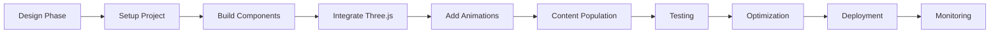

# Implementation Guide & Technical Approach

Step-by-step technical implementation guide for building the portfolio website, from setup to deployment.

---

## Table of Contents

1. [Project Setup](#project-setup)
2. [Development Workflow](#development-workflow)
3. [Implementation Phases](#implementation-phases)
4. [Code Standards](#code-standards)
5. [Testing Strategy](#testing-strategy)
6. [Optimization Techniques](#optimization-techniques)
7. [Deployment Process](#deployment-process)
8. [Maintenance & Updates](#maintenance--updates)

---

## Project Setup

### Initial Setup Steps

```bash
# 1. Create project directory
mkdir portfolio-website
cd portfolio-website

# 2. Initialize npm project
npm init -y

# 3. Install dependencies
npm install three@^0.160.0 gsap@^3.12.0 @studio-freight/lenis@^1.0.0

# 4. Install dev dependencies
npm install -D vite@^5.0.0 vite-plugin-glsl@^1.1.0

# 5. Create directory structure
mkdir -p src/{js/{core,three,animations,components,lib},css/{base,layout,components,animations},shaders/morphing,assets/images,data}
mkdir -p public/{images,videos,fonts,favicon}
mkdir -p docs
```

### Package.json Configuration

```json
{
  "name": "mascha-portfolio",
  "version": "1.0.0",
  "type": "module",
  "description": "Portfolio website for Mascha - AI Visual Director & Creative Technologist",
  "scripts": {
    "dev": "vite",
    "build": "vite build",
    "preview": "vite preview",
    "lint": "eslint src --ext .js",
    "format": "prettier --write 'src/**/*.{js,css,html}'"
  },
  "dependencies": {
    "three": "^0.160.0",
    "gsap": "^3.12.0",
    "@studio-freight/lenis": "^1.0.0"
  },
  "devDependencies": {
    "vite": "^5.0.0",
    "vite-plugin-glsl": "^1.1.0",
    "eslint": "^8.54.0",
    "prettier": "^3.1.0"
  }
}
```

### Vite Configuration

**File:** `vite.config.js`

```javascript
import { defineConfig } from 'vite';
import glsl from 'vite-plugin-glsl';

export default defineConfig({
  plugins: [
    glsl({
      include: [
        '**/*.glsl',
        '**/*.vert',
        '**/*.frag',
      ],
      compress: true,
    }),
  ],
  
  build: {
    outDir: 'dist',
    assetsDir: 'assets',
    sourcemap: false,
    minify: 'terser',
    
    terserOptions: {
      compress: {
        drop_console: true,
        drop_debugger: true,
      },
    },
    
    rollupOptions: {
      output: {
        manualChunks: {
          'three': ['three'],
          'animations': ['gsap', '@studio-freight/lenis'],
        },
      },
    },
  },
  
  server: {
    port: 3000,
    open: true,
    host: true,
  },
  
  preview: {
    port: 4173,
    open: true,
  },
});
```

### ESLint Configuration

**File:** `.eslintrc.json`

```json
{
  "env": {
    "browser": true,
    "es2021": true
  },
  "extends": "eslint:recommended",
  "parserOptions": {
    "ecmaVersion": "latest",
    "sourceType": "module"
  },
  "rules": {
    "no-unused-vars": "warn",
    "no-console": "off",
    "semi": ["error", "always"],
    "quotes": ["error", "single"]
  }
}
```

### Git Configuration

**File:** `.gitignore`

```
# Dependencies
node_modules/
package-lock.json
yarn.lock

# Build output
dist/
.vite/

# Environment variables
.env
.env.local
.env.production

# IDE
.vscode/
.idea/
*.swp
*.swo

# OS files
.DS_Store
Thumbs.db
desktop.ini

# Logs
*.log
npm-debug.log*

# Testing
coverage/

# Temporary files
*.tmp
.cache/
```

---

## Development Workflow

### Development Process



### Daily Development Routine

1. **Start Development Server**
   ```bash
   npm run dev
   ```

2. **Work on Features** (feature branches)
   ```bash
   git checkout -b feature/component-name
   # Make changes
   git add .
   git commit -m "feat: add component description"
   ```

3. **Test Changes**
   - Visual testing in browser
   - Cross-browser testing
   - Performance profiling

4. **Merge to Main**
   ```bash
   git checkout main
   git merge feature/component-name
   git push origin main
   ```

### Branch Strategy

```
main (production)
  ├── develop (staging)
  │   ├── feature/hero-section
  │   ├── feature/three-scene
  │   ├── feature/projects-section
  │   └── fix/animation-bug
  └── hotfix/critical-fix
```

---

## Implementation Phases

### Phase 1: Foundation (Week 1)

**Goal:** Set up project infrastructure and base styles

**Tasks:**

1. **Project Setup** (Day 1)
   ```bash
   # Initialize project
   npm init -y
   npm install dependencies
   
   # Create directory structure
   # Set up Git repository
   # Configure Vite
   ```

2. **HTML Structure** (Day 1-2)
   - Create `index.html` with semantic structure
   - Add meta tags, Open Graph data
   - Set up basic sections (hero, projects, experience, awards, contact)

3. **CSS Foundation** (Day 2-3)
   - Create CSS reset/normalize
   - Define CSS custom properties (design tokens)
   - Build typography system
   - Create utility classes

4. **Layout System** (Day 3-4)
   - Build container system
   - Create grid utilities
   - Implement responsive breakpoints
   - Test on various screen sizes

5. **Navigation Component** (Day 4-5)
   - Build header/navigation
   - Implement mobile menu
   - Add scroll behavior
   - Create active state logic

**Deliverables:**
- ✅ Functional development environment
- ✅ Complete HTML structure
- ✅ Design system CSS
- ✅ Responsive navigation
- ✅ Mobile-first layout

---

### Phase 2: Core Features (Week 2)

**Goal:** Implement main sections and smooth scroll

**Tasks:**

1. **Smooth Scroll Setup** (Day 1)
   ```javascript
   // src/js/core/SmoothScroll.js
   import Lenis from '@studio-freight/lenis';
   
   export function initSmoothScroll() {
     const lenis = new Lenis({
       duration: 1.2,
       easing: (t) => Math.min(1, 1.001 - Math.pow(2, -10 * t)),
       smooth: true,
     });
     
     function raf(time) {
       lenis.raf(time);
       requestAnimationFrame(raf);
     }
     
     requestAnimationFrame(raf);
     return lenis;
   }
   ```

2. **Hero Section** (Day 1-2)
   - Build hero HTML/CSS
   - Add title animations (prepare for Three.js)
   - Create scroll indicator
   - Implement fade-out on scroll

3. **Projects Section** (Day 2-3)
   - Load project data from JSON
   - Create project card component
   - Implement alternating layouts
   - Add hover effects

4. **Experience Section** (Day 3-4)
   - Build timeline component
   - Create skills visualization
   - Load data from JSON
   - Add reveal animations

5. **Awards & Contact Sections** (Day 4-5)
   - Build awards grid
   - Create contact form
   - Add form validation
   - Implement social links

**Deliverables:**
- ✅ Smooth scroll implementation
- ✅ All section HTML/CSS complete
- ✅ Basic animations in place
- ✅ Content loaded from JSON
- ✅ Functional contact form

---

### Phase 3: Three.js Integration (Week 3)

**Goal:** Implement 3D morphing shape with scroll control

**Tasks:**

1. **Scene Setup** (Day 1)
   ```javascript
   // src/js/three/ThreeScene.js
   import * as THREE from 'three';
   
   export class ThreeScene {
     constructor(canvas) {
       this.canvas = canvas;
       this.scene = null;
       this.camera = null;
       this.renderer = null;
       this.mesh = null;
     }
     
     async init() {
       this.setupScene();
       this.setupCamera();
       this.setupRenderer();
       this.setupLights();
       await this.createMorphingShape();
       this.animate();
     }
     
     // Implementation details...
   }
   ```

2. **Morphing Geometry** (Day 2-3)
   - Create icosahedron geometry
   - Implement vertex shader for displacement
   - Add noise-based morphing
   - Test different subdivision levels

3. **Glass Material** (Day 3-4)
   - Create custom shader material
   - Implement glass/translucent properties
   - Add fresnel effects
   - Configure reflections

4. **Scroll Integration** (Day 4-5)
   - Connect scroll position to shape
   - Implement position/rotation updates
   - Add morph intensity control
   - Create fade-out effect

5. **Performance Optimization** (Day 5)
   - Implement LOD system
   - Add device detection
   - Create 2D fallback for mobile
   - Test on various devices

**Deliverables:**
- ✅ Functional Three.js scene
- ✅ Morphing shape with shaders
- ✅ Scroll-driven animations
- ✅ Mobile optimizations
- ✅ 60fps on desktop, 30fps on mobile

---

### Phase 4: Animations & Polish (Week 4)

**Goal:** Add GSAP animations and micro-interactions

**Tasks:**

1. **GSAP Setup** (Day 1)
   ```javascript
   // src/js/core/ScrollTriggers.js
   import { gsap } from 'gsap';
   import { ScrollTrigger } from 'gsap/ScrollTrigger';
   
   gsap.registerPlugin(ScrollTrigger);
   
   export function initScrollTriggers() {
     // Hero animations
     gsap.timeline({
       scrollTrigger: {
         trigger: '#hero',
         start: 'top top',
         end: 'bottom top',
         scrub: 1,
       }
     })
     .to('#hero-title', { y: -100, opacity: 0 });
     
     // More animations...
   }
   ```

2. **Section Reveals** (Day 1-2)
   - Implement fade-in-up animations
   - Add stagger effects
   - Create parallax images
   - Test animation timing

3. **Micro-Interactions** (Day 2-3)
   - Magnetic hover effects
   - Button animations
   - Link underline effects
   - Card lift on hover

4. **Page Load Sequence** (Day 3-4)
   - Create loading screen
   - Implement entry animations
   - Add preloader for assets
   - Test load performance

5. **Final Polish** (Day 4-5)
   - Refine animation timing
   - Add easing variations
   - Test on multiple devices
   - Fix animation bugs

**Deliverables:**
- ✅ Complete animation system
- ✅ All micro-interactions working
- ✅ Smooth page load experience
- ✅ Polished user interactions
- ✅ Cross-browser tested

---

### Phase 5: Optimization & Deployment (Week 5)

**Goal:** Optimize performance and deploy to production

**Tasks:**

1. **Image Optimization** (Day 1)
   ```bash
   # Convert images to WebP
   # Resize to appropriate dimensions
   # Implement lazy loading
   # Add responsive images
   ```

2. **Code Optimization** (Day 1-2)
   - Minify CSS/JS
   - Remove unused code
   - Implement code splitting
   - Optimize bundle size

3. **Performance Audit** (Day 2-3)
   - Run Lighthouse audits
   - Fix performance issues
   - Optimize Core Web Vitals
   - Test on slow connections

4. **Accessibility Testing** (Day 3-4)
   - Keyboard navigation
   - Screen reader testing
   - Color contrast check
   - ARIA labels verification

5. **Deployment** (Day 4-5)
   - Choose hosting platform (Vercel/Netlify)
   - Configure domain
   - Set up SSL
   - Deploy to production
   - Monitor performance

**Deliverables:**
- ✅ Optimized assets
- ✅ Lighthouse score >90
- ✅ Accessibility compliant
- ✅ Live production site
- ✅ Monitoring in place

---

## Code Standards

### JavaScript Style Guide

```javascript
// Use ES6+ features
const myFunction = (param) => {
  // Function body
};

// Destructuring
const { property } = object;

// Template literals
const message = `Hello, ${name}!`;

// Classes for components
class MyComponent {
  constructor(element) {
    this.element = element;
    this.init();
  }
  
  init() {
    // Initialization logic
  }
}

// Async/await for promises
async function loadData() {
  const response = await fetch('/api/data');
  const data = await response.json();
  return data;
}
```

### CSS Naming Convention (BEM)

```css
/* Block */
.card {}

/* Element */
.card__title {}
.card__description {}

/* Modifier */
.card--featured {}
.card--large {}

/* Example usage */
.project-card {}
.project-card__image {}
.project-card__content {}
.project-card__title {}
.project-card--featured {}
```

### File Organization

```
src/js/
  ├── main.js              # Entry point
  ├── config.js            # Configuration
  ├── core/                # Core functionality
  │   ├── SmoothScroll.js
  │   └── Navigation.js
  ├── three/               # Three.js related
  │   ├── ThreeScene.js
  │   └── MorphingShape.js
  ├── animations/          # Animation modules
  │   └── ScrollTriggers.js
  └── components/          # UI components
      ├── Hero.js
      ├── Projects.js
      └── Contact.js
```

---

## Testing Strategy

### Manual Testing Checklist

**Visual Testing:**
- [ ] All sections render correctly
- [ ] Animations are smooth
- [ ] Hover states work
- [ ] No layout shifts
- [ ] Images load properly

**Functional Testing:**
- [ ] Navigation works
- [ ] Smooth scroll functions
- [ ] Forms submit correctly
- [ ] Links navigate properly
- [ ] Mobile menu toggles

**Performance Testing:**
- [ ] Page loads in <3 seconds
- [ ] Three.js runs at 60fps (desktop)
- [ ] No janky animations
- [ ] Images lazy load
- [ ] No memory leaks

**Browser Testing:**
- [ ] Chrome (latest)
- [ ] Firefox (latest)
- [ ] Safari (latest)
- [ ] Edge (latest)
- [ ] Mobile Safari
- [ ] Mobile Chrome

**Device Testing:**
- [ ] Desktop (1920x1080)
- [ ] Laptop (1366x768)
- [ ] Tablet (768x1024)
- [ ] Mobile (375x667)
- [ ] Large mobile (414x896)

---

## Optimization Techniques

### Image Optimization

```bash
# Convert to WebP
cwebp input.jpg -q 80 -o output.webp

# Resize images
convert input.jpg -resize 1920x1080 output.jpg

# Optimize SVG
svgo input.svg -o output.svg
```

### Code Splitting

```javascript
// vite.config.js
export default {
  build: {
    rollupOptions: {
      output: {
        manualChunks: {
          'three': ['three'],
          'animations': ['gsap'],
        },
      },
    },
  },
};
```

### Lazy Loading

```javascript
// Lazy load Three.js scene
const lazyLoadThree = async () => {
  const { ThreeScene } = await import('./js/three/ThreeScene.js');
  const scene = new ThreeScene(canvas);
  scene.init();
};

// Load when needed
if (window.innerWidth > 768) {
  lazyLoadThree();
}
```

---

## Deployment Process

### Pre-Deployment Checklist

- [ ] All features tested
- [ ] Performance optimized
- [ ] SEO meta tags added
- [ ] Favicon set
- [ ] Analytics configured
- [ ] Error handling in place
- [ ] Environment variables set

### Vercel Deployment

```bash
# 1. Install Vercel CLI
npm install -g vercel

# 2. Login
vercel login

# 3. Deploy
vercel --prod

# 4. Custom domain
vercel domains add mascha.art
```

### Environment Variables

```bash
# .env.production
VITE_API_URL=https://api.mascha.art
VITE_ANALYTICS_ID=UA-XXXXXXXXX-X
```

### Post-Deployment

1. **Verify Deployment**
   - Check all pages load
   - Test all features
   - Verify SSL certificate

2. **Monitor Performance**
   - Set up Google Analytics
   - Monitor Core Web Vitals
   - Check error logs

3. **Submit to Search Engines**
   - Submit sitemap to Google
   - Add to Bing Webmaster Tools
   - Verify Search Console

---

## Maintenance & Updates

### Regular Maintenance Tasks

**Weekly:**
- Monitor analytics
- Check error logs
- Test critical paths

**Monthly:**
- Update dependencies
- Review performance metrics
- Check broken links
- Update content

**Quarterly:**
- Security audit
- Performance review
- Content refresh
- Feature additions

### Update Process

```bash
# 1. Check for updates
npm outdated

# 2. Update dependencies
npm update

# 3. Test changes
npm run dev
# Manual testing

# 4. Build and deploy
npm run build
vercel --prod
```

---

## Troubleshooting Guide

### Common Issues

**Three.js not rendering:**
```javascript
// Check canvas exists
const canvas = document.getElementById('three-canvas');
if (!canvas) {
  console.error('Canvas element not found');
  return;
}

// Check WebGL support
const gl = canvas.getContext('webgl');
if (!gl) {
  console.error('WebGL not supported');
  // Show fallback
}
```

**Animations not smooth:**
```javascript
// Reduce particle count
// Lower polygon count
// Disable effects on mobile
// Use requestAnimationFrame
```

**Build errors:**
```bash
# Clear cache
rm -rf node_modules
npm install

# Clear Vite cache
rm -rf .vite

# Rebuild
npm run build
```

---

## Performance Targets

### Target Metrics

**Lighthouse Scores:**
- Performance: >90
- Accessibility: >95
- Best Practices: >90
- SEO: >90

**Core Web Vitals:**
- LCP (Largest Contentful Paint): <2.5s
- FID (First Input Delay): <100ms
- CLS (Cumulative Layout Shift): <0.1

**Custom Metrics:**
- Time to Interactive: <3s
- First Contentful Paint: <1.5s
- Three.js FPS: 60fps (desktop), 30fps (mobile)

---

**Document Version:** 1.0  
**Last Updated:** October 2025  
**Related:** [`ARCHITECTURE.md`](ARCHITECTURE.md), [`FILE_STRUCTURE.md`](FILE_STRUCTURE.md)