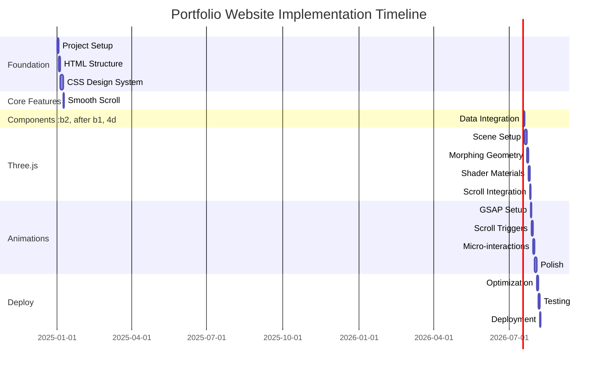

# Mascha Portfolio Website - Complete Architecture Plan

> **A comprehensive architecture plan for a cutting-edge portfolio website showcasing AI-driven visual effects and creative technology expertise, inspired by WRK Timepieces.**

---

## ⚡ Quick Start

### Option 1: Use the Startup Script (Easiest - Windows)

1. **Double-click [`start.bat`](start.bat)** in the portfolio-website folder
   - Automatically checks for Node.js
   - Installs dependencies if needed
   - Starts the development server
   - Opens browser to `http://localhost:3000`

### Option 2: Manual Start

```bash
# Navigate to project directory
cd portfolio-website

# Install dependencies (first time only)
npm install

# Start development server
npm run dev
```

### 📚 Essential Guides

**🚀 Getting Started:**
- 📖 **[SETUP_GUIDE.md](SETUP_GUIDE.md)** - Complete installation, troubleshooting, and configuration
- ⭐ **[PROJECT_SUMMARY.md](PROJECT_SUMMARY.md)** - Complete project overview and what was built
- ✅ **[TESTING_CHECKLIST.md](TESTING_CHECKLIST.md)** - Comprehensive testing guide for all features

**✏️ Content & Deployment:**
- 📝 **[CONTENT_UPDATE_GUIDE.md](CONTENT_UPDATE_GUIDE.md)** - ⭐ How to replace placeholder content
- 🚀 **[DEPLOYMENT_GUIDE.md](DEPLOYMENT_GUIDE.md)** - ⭐ How to deploy to production (Vercel, Netlify, etc.)

**🔧 Technical Documentation:**
- 🏗️ **[ARCHITECTURE.md](ARCHITECTURE.md)** - System overview and technical architecture
- 📦 **[COMPONENTS.md](COMPONENTS.md)** - Component specifications and API
- 🎨 **[DESIGN_SYSTEM.md](DESIGN_SYSTEM.md)** - Colors, typography, and design tokens
- 🎬 **[ANIMATION_SPECS.md](ANIMATION_SPECS.md)** - Animation system and Three.js details
- 📁 **[FILE_STRUCTURE.md](FILE_STRUCTURE.md)** - Complete directory organization
- 📋 **[IMPLEMENTATION_GUIDE.md](IMPLEMENTATION_GUIDE.md)** - Step-by-step build instructions

### 🚨 Troubleshooting

**Port 3000 already in use?**
```bash
# Vite will automatically try port 3001, 3002, etc.
# Or change port in vite.config.js
```

**Three.js not rendering?**
- Check WebGL support: https://get.webgl.org/
- Update graphics drivers
- See [SETUP_GUIDE.md#threejs-scene-not-rendering](SETUP_GUIDE.md#issue-threejs-scene-not-rendering)

**Module not found errors?**
- Ensure `npm install` completed successfully
- Check file paths in imports (must include `.js` extension)
- See [SETUP_GUIDE.md#troubleshooting](SETUP_GUIDE.md#troubleshooting)

For detailed troubleshooting, see **[SETUP_GUIDE.md](SETUP_GUIDE.md#troubleshooting)**

---

## 📋 Project Overview

This portfolio website is designed for **Mascha**, an Artist & Creative Technologist specializing in AI-driven visual effects, cinematography, and immersive experiences. The site targets film production companies seeking innovative VFX and AI visual direction capabilities.

### Key Features

- **Epic Hero Section** with morphing Three.js glass/slime shape
- **Scroll-Driven Storytelling** with smooth parallax and fade animations
- **5 Featured Projects** showcasing AI/VFX work with cinematic presentation
- **Interactive Timeline** for experience/CV visualization
- **Awards Grid** displaying industry recognition
- **Professional Contact Form** with validation
- **Minimalistic Black Theme** with glass morphism effects
- **Responsive Design** optimized for all devices
- **60fps Performance** on desktop, optimized for mobile

---

## 🎯 Design Direction

**Aesthetic:** Modern, futuristic, minimalistic, epic  
**Inspiration:** [WRK Timepieces](https://www.wrk-timepieces.com/products/acf-01)  
**Color Scheme:** Monochromatic black/white with subtle blue accents  
**Typography:** Space Grotesk (clean, contemporary sans-serif)  
**Effects:** Glass morphism, smooth parallax, magnetic hovers, scroll-driven animations

---

## 📚 Documentation Structure

This architecture plan consists of comprehensive documentation organized as follows:

### Core Documentation

| Document | Description | Purpose |
|----------|-------------|---------|
| **[ARCHITECTURE.md](ARCHITECTURE.md)** | System overview and high-level design | Understand the overall project structure and approach |
| **[FILE_STRUCTURE.md](FILE_STRUCTURE.md)** | Complete directory and file organization | Navigate the codebase and understand file relationships |
| **[COMPONENTS.md](COMPONENTS.md)** | Component architecture and specifications | Build modular, reusable components |
| **[ANIMATION_SPECS.md](ANIMATION_SPECS.md)** | Animation system and Three.js details | Implement smooth, performant animations |
| **[CONTENT_STRUCTURE.md](CONTENT_STRUCTURE.md)** | Placeholder content and data models | Populate the site with professional content |
| **[DESIGN_SYSTEM.md](DESIGN_SYSTEM.md)** | Typography, colors, spacing, and UI patterns | Maintain consistent visual design |
| **[IMPLEMENTATION_GUIDE.md](IMPLEMENTATION_GUIDE.md)** | Step-by-step build instructions | Execute the project from setup to deployment |

---

## 🚀 Quick Start Guide

### Prerequisites

- Node.js 18+ and npm
- Modern code editor (VS Code recommended)
- Git for version control
- Basic understanding of HTML/CSS/JavaScript
- Familiarity with Three.js and GSAP (helpful but not required)

### Setup Instructions

```bash
# 1. Create project directory
mkdir portfolio-website
cd portfolio-website

# 2. Initialize project
npm init -y

# 3. Install dependencies
npm install three@^0.160.0 gsap@^3.12.0 @studio-freight/lenis@^1.0.0

# 4. Install dev dependencies
npm install -D vite@^5.0.0 vite-plugin-glsl@^1.1.0

# 5. Create directory structure (see FILE_STRUCTURE.md)
mkdir -p src/{js,css,shaders,assets,data}
mkdir -p public/{images,videos,fonts}

# 6. Start development server
npm run dev
```

### Development Workflow

1. **Read the Documentation** - Start with [ARCHITECTURE.md](ARCHITECTURE.md)
2. **Set Up Project** - Follow [IMPLEMENTATION_GUIDE.md](IMPLEMENTATION_GUIDE.md) Phase 1
3. **Build Components** - Reference [COMPONENTS.md](COMPONENTS.md)
4. **Add Animations** - Implement using [ANIMATION_SPECS.md](ANIMATION_SPECS.md)
5. **Apply Design System** - Use tokens from [DESIGN_SYSTEM.md](DESIGN_SYSTEM.md)
6. **Populate Content** - Load data from [CONTENT_STRUCTURE.md](CONTENT_STRUCTURE.md)

---

## 🏗️ Implementation Roadmap

### 5-Week Development Plan



### Phase Breakdown

#### **Week 1: Foundation**
- ✅ Project setup and tooling
- ✅ HTML structure with semantic markup
- ✅ CSS design system implementation
- ✅ Responsive layout framework
- ✅ Navigation component

**Deliverable:** Fully styled static website with responsive layout

#### **Week 2: Core Features**
- ✅ Smooth scroll implementation (Lenis)
- ✅ Hero, Projects, Experience, Awards, Contact sections
- ✅ Component-based architecture
- ✅ JSON data integration
- ✅ Basic scroll animations

**Deliverable:** Functional website with all sections and content

#### **Week 3: Three.js Integration**
- ✅ Three.js scene setup
- ✅ Morphing icosahedron geometry
- ✅ Custom glass shader material
- ✅ Scroll-driven 3D transformations
- ✅ Performance optimization

**Deliverable:** Hero section with animated 3D element

#### **Week 4: Animations & Polish**
- ✅ GSAP ScrollTrigger animations
- ✅ Section reveal animations
- ✅ Hover effects and micro-interactions
- ✅ Page load sequence
- ✅ Animation refinement

**Deliverable:** Fully animated, polished user experience

#### **Week 5: Optimization & Launch**
- ✅ Image optimization and lazy loading
- ✅ Code splitting and minification
- ✅ Performance audit (Lighthouse >90)
- ✅ Accessibility testing (WCAG 2.1 AA)
- ✅ Production deployment

**Deliverable:** Live production website

---

## 🛠️ Tech Stack

### Core Technologies

| Technology | Version | Purpose |
|------------|---------|---------|
| **HTML5** | - | Semantic structure, accessibility |
| **CSS3** | - | Styling, animations, layouts |
| **JavaScript (ES6+)** | - | Application logic, interactivity |
| **Three.js** | ^0.160.0 | WebGL 3D rendering |
| **GSAP** | ^3.12.0 | Advanced animations |
| **Lenis** | ^1.0.0 | Smooth scrolling |

### Development Tools

| Tool | Purpose |
|------|---------|
| **Vite** | Fast build tool and dev server |
| **vite-plugin-glsl** | GLSL shader compilation |
| **ESLint** | Code linting |
| **Prettier** | Code formatting |
| **Git** | Version control |

### Recommended Hosting

- **Vercel** (Primary recommendation) - Automatic deployments, CDN, SSL
- **Netlify** - Alternative with similar features
- **GitHub Pages** - Free hosting option

---

## 📦 Project Structure

```
portfolio-website/
│
├── docs/                          # Architecture documentation
│   ├── ARCHITECTURE.md           # System overview
│   ├── FILE_STRUCTURE.md         # Directory structure
│   ├── COMPONENTS.md             # Component specs
│   ├── ANIMATION_SPECS.md        # Animation details
│   ├── CONTENT_STRUCTURE.md      # Content and data
│   ├── DESIGN_SYSTEM.md          # Design tokens
│   └── IMPLEMENTATION_GUIDE.md   # Build instructions
│
├── src/                          # Source files
│   ├── js/                       # JavaScript modules
│   │   ├── main.js              # Entry point
│   │   ├── core/                # Core functionality
│   │   ├── three/               # Three.js related
│   │   ├── animations/          # Animation modules
│   │   └── components/          # UI components
│   │
│   ├── css/                      # Stylesheets
│   │   ├── main.css             # Main stylesheet
│   │   ├── base/                # Foundation styles
│   │   ├── layout/              # Layout components
│   │   ├── components/          # Component styles
│   │   └── animations/          # Animation styles
│   │
│   ├── shaders/                  # GLSL shaders
│   │   └── morphing/            # Morphing shape shaders
│   │
│   ├── data/                     # JSON content
│   │   ├── projects.json        # Project data
│   │   ├── experience.json      # CV/experience
│   │   ├── awards.json          # Awards data
│   │   └── skills.json          # Skills data
│   │
│   └── assets/                   # Raw assets
│       └── images/              # Source images
│
├── public/                       # Static assets
│   ├── images/                  # Optimized images
│   ├── videos/                  # Video assets
│   ├── fonts/                   # Web fonts
│   └── favicon/                 # Favicon files
│
├── index.html                    # Main HTML file
├── package.json                  # Dependencies
├── vite.config.js               # Vite configuration
└── README.md                     # This file
```

---

## 🎨 Design System Highlights

### Color Palette

```css
/* Core Colors */
--color-black: #000000        /* Primary background */
--color-white: #ffffff        /* Primary text */
--color-gray-300: #d4d4d4     /* Secondary text */

/* Accents */
--color-accent-blue: #3b82f6   /* Primary accent */
--color-accent-cyan: #06b6d4   /* Secondary accent */
--color-accent-purple: #8b5cf6 /* Tertiary accent */

/* Glass Morphism */
--glass-bg: rgba(255, 255, 255, 0.05)
--glass-border: rgba(255, 255, 255, 0.1)
```

### Typography Scale

```css
/* Display & Headings */
--text-7xl: 5.96rem      /* Hero title */
--text-6xl: 4.768rem     /* H1 */
--text-5xl: 3.815rem     /* H2 */

/* Body Text */
--text-base: 1rem        /* Body */
--text-lg: 1.25rem       /* Lead text */
```

### Spacing System (8px base)

```css
--space-2: 0.5rem       /* 8px */
--space-4: 1rem         /* 16px */
--space-6: 1.5rem       /* 24px */
--space-8: 2rem         /* 32px */
--space-12: 3rem        /* 48px */
--space-16: 4rem        /* 64px */
```

---

## ✨ Key Features Breakdown

### 1. Hero Section with 3D Animation

**Visual:** Morphing glass/slime shape that responds to scroll  
**Tech:** Three.js IcosahedronGeometry with custom GLSL shaders  
**Animation:** Position, rotation, scale, morph intensity all scroll-driven  
**Performance:** LOD system, mobile fallback, 60fps target

### 2. Project Showcase (5 Featured)

**Layout:** Alternating left/right with large hero images  
**Content:** AI cinematography, VFX, installations, live events  
**Interaction:** Parallax images, hover reveals, case study links  
**Data:** Loaded from `projects.json` for easy updates

### 3. Experience Timeline

**Visual:** Vertical timeline with dates and descriptions  
**Animation:** Line draw effect, staggered entry reveals  
**Content:** Professional experience, skills matrix  
**Data:** Loaded from `experience.json`

### 4. Awards Grid

**Layout:** Responsive grid/masonry  
**Animation:** Staggered fade-in with bounce effect  
**Content:** 8+ industry awards and recognition  
**Interaction:** Hover lift effect

### 5. Contact Section

**Features:** Form validation, email integration  
**Design:** Glass morphism form fields  
**Elements:** Social links, availability status  
**Interaction:** Magnetic hover on social icons

---

## 🎯 Performance Targets

### Lighthouse Scores
- **Performance:** >90
- **Accessibility:** >95
- **Best Practices:** >90
- **SEO:** >90

### Core Web Vitals
- **LCP (Largest Contentful Paint):** <2.5s
- **FID (First Input Delay):** <100ms
- **CLS (Cumulative Layout Shift):** <0.1

### Custom Metrics
- **Three.js FPS:** 60fps (desktop), 30fps (mobile)
- **Time to Interactive:** <3s
- **Bundle Size:** <300KB (minified + gzipped)

---

## 📱 Responsive Strategy

### Breakpoints

| Device | Width | Layout |
|--------|-------|--------|
| Mobile | <768px | Single column, simplified 3D or 2D fallback |
| Tablet | 768-1023px | Two columns, moderate 3D complexity |
| Desktop | 1024-1439px | Multi-column, full 3D capabilities |
| Large Desktop | 1440px+ | Enhanced spacing, full features |

### Mobile Optimizations
- Reduced polygon count for 3D shape
- 2D animated gradient fallback option
- Touch-optimized interactions
- Simplified animations
- Hamburger navigation

---

## 🔒 Browser Support

### Target Browsers
- Chrome 90+ (primary development target)
- Firefox 88+
- Safari 14+
- Edge 90+
- Mobile Safari iOS 14+
- Mobile Chrome Android 90+

### Feature Detection
- WebGL support detection with 2D fallback
- IntersectionObserver with scroll event fallback
- CSS Grid with Flexbox fallback
- Reduced motion media query support

---

## 🚢 Deployment Checklist

### Pre-Deployment
- [ ] All features implemented and tested
- [ ] Performance optimized (Lighthouse >90)
- [ ] Images optimized and compressed
- [ ] SEO meta tags added
- [ ] Favicon set
- [ ] Analytics configured
- [ ] Error handling implemented
- [ ] Cross-browser tested
- [ ] Mobile responsiveness verified
- [ ] Accessibility audit passed

### Deployment Steps
1. Build production bundle: `npm run build`
2. Test production build: `npm run preview`
3. Deploy to hosting platform (Vercel/Netlify)
4. Configure custom domain
5. Verify SSL certificate
6. Submit sitemap to search engines
7. Monitor performance and errors

### Post-Deployment
- [ ] Verify all pages load correctly
- [ ] Test all interactive features
- [ ] Check Core Web Vitals
- [ ] Monitor error logs
- [ ] Set up uptime monitoring
- [ ] Create backup strategy

---

## 📖 Learning Resources

### Three.js
- [Three.js Documentation](https://threejs.org/docs/)
- [Three.js Journey Course](https://threejs-journey.com/)
- [WebGL Fundamentals](https://webglfundamentals.org/)

### GSAP
- [GSAP Documentation](https://greensock.com/docs/)
- [ScrollTrigger Docs](https://greensock.com/scrolltrigger/)
- [GSAP Showcase](https://greensock.com/showcase/)

### Web Performance
- [Web.dev Performance](https://web.dev/performance/)
- [Core Web Vitals](https://web.dev/vitals/)
- [Chrome DevTools Performance](https://developer.chrome.com/docs/devtools/performance/)

---

## 🚀 What's Next?

**The website is complete and ready for you!** Here's your roadmap to launch:

### Step 1: Update Your Content (30-60 minutes)

📝 **Follow the** [**CONTENT_UPDATE_GUIDE.md**](CONTENT_UPDATE_GUIDE.md)

**Quick checklist:**
- [ ] Replace projects in [`src/data/content.js`](src/data/content.js:18) with your real work
- [ ] Update experience, awards, and bio sections
- [ ] Change contact information and social media links
- [ ] Add your project images to [`public/images/projects/`](public/images/projects/)
- [ ] Add your profile photo to [`public/images/profile/`](public/images/profile/)

### Step 2: Test Your Changes (15-30 minutes)

```bash
# Start the development server
npm run dev

# Visit http://localhost:3000
```

**Check that:**
- [ ] All your content displays correctly
- [ ] Images load properly (no broken images)
- [ ] Links work (social media, email, projects)
- [ ] Animations are smooth
- [ ] Everything looks good on mobile (use browser DevTools)

### Step 3: Deploy to Production (20-40 minutes)

🚀 **Follow the** [**DEPLOYMENT_GUIDE.md**](DEPLOYMENT_GUIDE.md)

**Recommended: Deploy with Vercel** (fastest & easiest):
```bash
# Install Vercel CLI
npm install -g vercel

# Login and deploy
vercel login
vercel --prod
```

**Your site will be live in minutes!**

### Step 4: Launch & Share 🎉

- [ ] Test live site thoroughly
- [ ] Configure custom domain (optional)
- [ ] Share on LinkedIn, Instagram, Twitter
- [ ] Update your email signature
- [ ] Submit to portfolio showcases (Awwwards, Behance)
- [ ] Send to potential clients

---

## 🎨 Customization & Contribution

### Making Design Changes

**Colors:**
Edit [`src/styles/variables.css`](src/styles/variables.css) to change the color scheme:
```css
--color-accent-blue: #3b82f6;     /* Change to your brand color */
--color-accent-cyan: #06b6d4;     /* Secondary accent */
```

**Typography:**
To change fonts, update in [`src/styles/variables.css`](src/styles/variables.css):
```css
--font-primary: 'Your Font', sans-serif;
```
And add font link in [`index.html`](index.html:35)

**Layout:**
Adjust spacing in [`src/styles/variables.css`](src/styles/variables.css):
```css
--space-section: 8rem;  /* Space between sections */
--container-width: 1440px;  /* Max content width */
```

### Adding New Sections

1. **Create component file:** `src/components/NewSection.js`
2. **Import in** [`src/main.js`](src/main.js)
3. **Add HTML structure in** [`index.html`](index.html)
4. **Add data to** [`src/data/content.js`](src/data/content.js)

**Example:**
```javascript
// src/components/NewSection.js
export class NewSection {
  constructor() {
    this.init();
  }
  
  init() {
    // Your component logic
  }
}
```

### Customizing Animations

**Adjust animation timing in** [`src/animations/ScrollAnimations.js`](src/animations/ScrollAnimations.js):
```javascript
// Change duration, delay, easing
gsap.from(element, {
  duration: 1.2,  // Animation length
  delay: 0.2,     // Start delay
  ease: 'power3.out'  // Easing function
});
```

**Modify Three.js scene** in [`src/three/MorphingShape.js`](src/three/MorphingShape.js):
```javascript
// Adjust geometry, materials, animations
this.geometry = new IcosahedronGeometry(2, 5);  // Size, subdivisions
```

### Contributing Improvements

**Found a bug or want to enhance the project?**

1. **Document the issue/enhancement**
   - Describe the problem or feature
   - Include steps to reproduce (for bugs)
   - Suggest a solution if possible

2. **Make changes in a branch**
   ```bash
   git checkout -b feature/your-feature-name
   ```

3. **Test thoroughly**
   - Run `npm run dev` and test locally
   - Check responsive design
   - Verify no console errors
   - Test in multiple browsers

4. **Commit with clear messages**
   ```bash
   git commit -m "Add: feature description"
   # or
   git commit -m "Fix: bug description"
   ```

### Project Philosophy

**This portfolio is built with:**
- ✨ **Simplicity** - Clean, maintainable code
- 🎨 **Beauty** - Stunning visuals that perform well
- ♿ **Accessibility** - Usable by everyone
- 📱 **Responsiveness** - Perfect on all devices
- ⚡ **Performance** - Fast loading, smooth animations

**When customizing, maintain these principles!**

---

## 🤝 Legacy Next Steps (For Reference)

<details>
<summary>Original implementation team guide (click to expand)</summary>

### For Implementation Team

1. **Review All Documentation**
   - Read through all `.md` files in order
   - Understand the architecture and design decisions
   - Ask questions and clarify requirements

2. **Set Up Development Environment**
   - Follow [IMPLEMENTATION_GUIDE.md](IMPLEMENTATION_GUIDE.md) setup instructions
   - Ensure all tools and dependencies are installed
   - Verify local development server runs

3. **Start Phase 1 Development**
   - Begin with foundation (Week 1 tasks)
   - Follow the 5-week roadmap
   - Reference documentation as needed

4. **Regular Check-ins**
   - Weekly progress reviews
   - Address blockers and questions
   - Adjust timeline if needed

### For Content Team

1. **Review Placeholder Content**
   - See [CONTENT_STRUCTURE.md](CONTENT_STRUCTURE.md)
   - Prepare real project descriptions and images
   - Gather awards, experience, and skills data

2. **Prepare Media Assets**
   - High-resolution project images (1920x1080)
   - Project demo videos (compressed, <10MB)
   - Award logos and badges
   - Profile/about photos

3. **Write Final Copy**
   - Hero tagline and title
   - Project descriptions (150-200 words each)
   - Bio/about section
   - Contact information

</details>

---

## 📞 Support & Questions

### Documentation Issues
If you find any issues or have suggestions for improving this documentation:
1. Review the specific document in question
2. Check related documents for additional context
3. Document your question or issue clearly
4. Propose solutions if possible

### Technical Questions
For technical implementation questions:
1. Refer to [IMPLEMENTATION_GUIDE.md](IMPLEMENTATION_GUIDE.md) troubleshooting section
2. Check browser console for error messages
3. Review code examples in documentation
4. Test in isolation to identify the issue

---

## 📄 License & Credits

### Inspiration
- [WRK Timepieces](https://www.wrk-timepieces.com/) - Design inspiration
- [Awwwards](https://www.awwwards.com/) - Creative direction
- [Codrops](https://tympanus.net/codrops/) - Animation patterns

### Technologies
- [Three.js](https://threejs.org/) - 3D rendering
- [GSAP](https://greensock.com/) - Animation library
- [Lenis](https://github.com/studio-freight/lenis) - Smooth scroll
- [Vite](https://vitejs.dev/) - Build tool

---

## 📝 Document Version Control

| Version | Date | Changes |
|---------|------|---------|
| 1.0 | October 2025 | Initial architecture plan created |

---

## 🎉 Conclusion

This comprehensive architecture plan provides everything needed to build a world-class portfolio website for Mascha. The documentation is organized to guide you from concept through deployment, with detailed specifications for every aspect of the project.

**Key Strengths:**
- ✅ Complete technical specifications
- ✅ Professional placeholder content
- ✅ Clear implementation roadmap
- ✅ Performance-first approach
- ✅ Responsive and accessible
- ✅ Industry-leading design

**Ready to build?** Start with [IMPLEMENTATION_GUIDE.md](IMPLEMENTATION_GUIDE.md) and follow the 5-week roadmap!

---

**Created:** October 2025  
**Status:** Ready for Implementation  
**Estimated Timeline:** 5 weeks  
**Team Size:** 1-2 developers + content manager